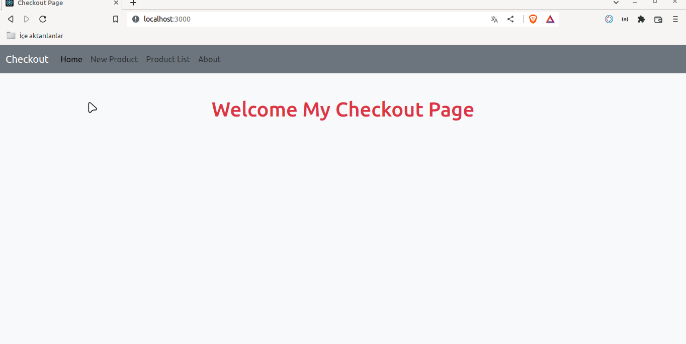

# Checkout Router with Axios

## Description

Project aims to create a Checkout Page App.

## Problem Statement

- We are adding a new project to our portfolios. So you and your colleagues have started to work on the project.

## Project Skeleton

```
Checkout Page App with Axios (folder)
|
|----readme.md        
SOLUTION
├── public
│     └── index.html
├── src
│   ├── App.js
│   ├── components
│   │    ├── CardTotal.jsx
│   │    ├── Navbar.jsx
│   │    ├── ProductCard.jsx
│   │    └── ProductForm.jsx
│   ├── index.css
│   ├── index.js
│   └── pages
│        ├── About.jsx
│        ├── Main.jsx
│        ├── NewProduct.jsx
│        ├── ProductList.jsx
│        └── UpdateProduct.jsx
├── package.json
└── yarn.lock

```

## Expected Outcome



## Objective

Build a Checkout Page App using ReactJS.

### At the end of the project, following topics are to be covered;

- HTML

- CSS

- JS

- ReactJS

### At the end of the project;

- improve coding skills within HTML & CSS & JS & ReactJS.

- use git commands (push, pull, commit, add etc.) and Github as Version Control System.

## Steps to Solution

- Step 1: Create React App using `npx create-react-app checkout-axios`

- Step 2 : Install `"react-icons"` package to your `package.json` for icons or fontawesome cdn link paste to "public/index.html" and install `axios` package.

- Step 3: Build Checkout Page App.

- Step 4: You can use CSS frameworks like Bootstrap, Material UI etc.

- Step 5: Push your application into your own public repo on Github

- Step 6: Add project gif to your project and README.md file.


**<p align="center">&#9786; Happy Coding &#9997;</p>**


- react-router =>proje multipage olduğu için react router u kullanmam gerekiyor
- axios => api işlemleri olduığu için axios kullanmam gerekiyor
- state => apiden gelen verilerimi tutabileceğim state e ihtiyacım var. Ve formdan aldığım bilgiler için
- bootsrap => styling için bootstrap kullancam
- useEffect => sayfam açılır açılmaz verilerim gelsin istediğim için use effect e ihtiyacım var